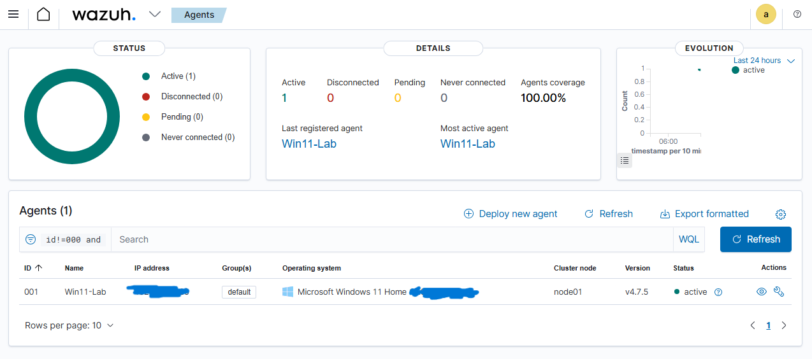
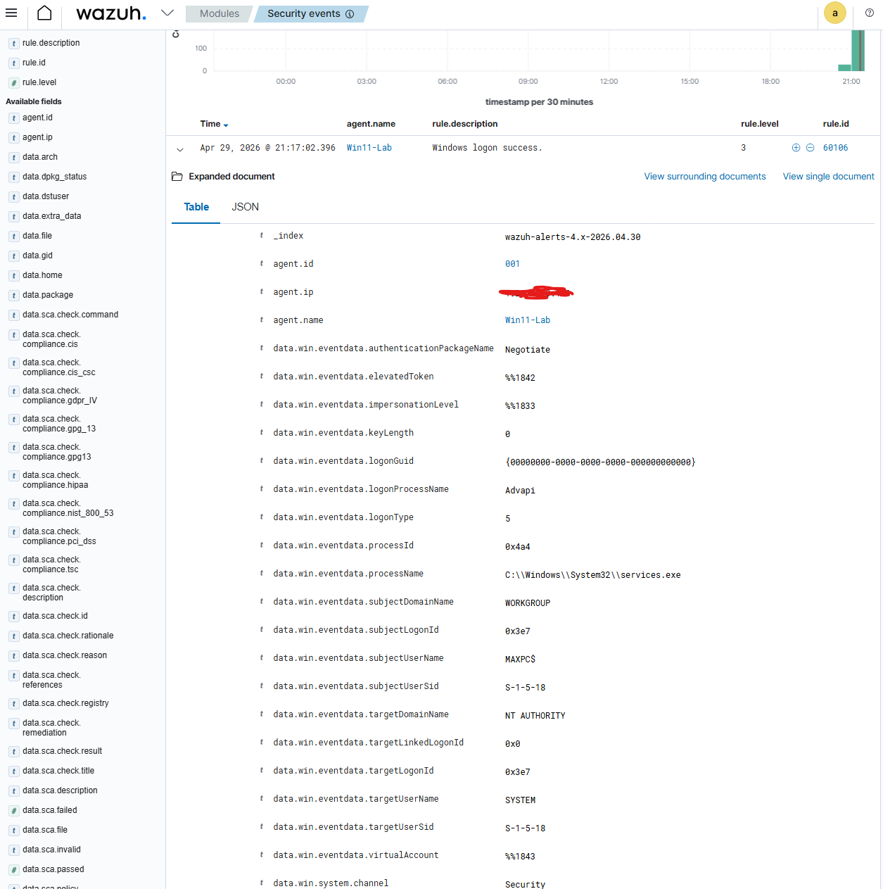
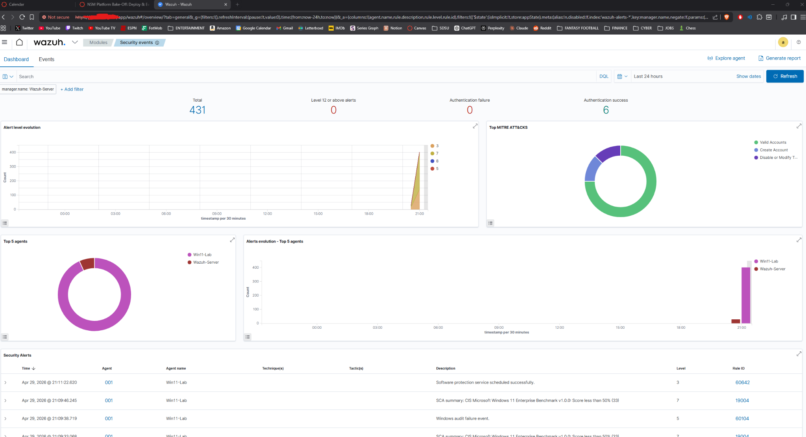

# Wazuh SIEM Lab

Hands-on Wazuh SIEM lab for endpoint monitoring, log analysis, and security event investigation in a virtualized environment.

## Overview

This project documents the deployment and testing of a Wazuh SIEM environment built in Oracle VirtualBox. I deployed a Wazuh all-in-one server on Ubuntu Server 22.04 and enrolled a Windows 11 endpoint using the Wazuh agent. The lab focused on collecting endpoint telemetry, monitoring Windows security events, and investigating authentication activity through the Wazuh dashboard. The goal was to gain hands-on experience deploying and working with a SIEM while learning how endpoint data can be centralized and analyzed for security monitoring.

## Architecture

The lab consisted of a Wazuh server and a Windows 11 endpoint running in a virtualized environment. Both systems used bridged networking, allowing them to communicate on the same local network and enabling the Windows agent to send security telemetry directly to the Wazuh server.

**Wazuh Server**
- Ubuntu Server 22.04
- Wazuh all-in-one deployment
- 4 vCPUs
- 8 GB RAM
- 50 GB storage

**Monitored Endpoint**
- Windows 11
- Wazuh agent
- Security event and endpoint telemetry collection

**Network**
- Oracle VirtualBox
- Bridged network adapters
- Local network communication between endpoint and SIEM

### Network Diagram

## What I Did

### 1. Deployed the Wazuh Server

I created an Ubuntu Server 22.04 virtual machine in Oracle VirtualBox and allocated 4 vCPUs, 8 GB of RAM, and 50 GB of storage. I then installed the Wazuh all-in-one deployment, which provided the central platform for collecting, indexing, and viewing security events.

The initial deployment required troubleshooting some network configuration and system compatibility issues before the dashboard and endpoint could communicate correctly.

### 2. Configured the Lab Network

I configured the virtual machines to use bridged networking so the Wazuh server and Windows endpoint could communicate over the same local network.

This allowed the Windows Wazuh agent to send endpoint telemetry and security events directly to the Wazuh server.

### 3. Enrolled a Windows 11 Endpoint

I installed the Wazuh agent on a Windows 11 system and enrolled it with the Wazuh server. After configuring the agent, I verified its connection through the Wazuh dashboard.

The endpoint appeared as **Active**, confirming that the server was successfully receiving telemetry from the Windows system.

### 4. Generated and Monitored Security Events

Once the endpoint was connected, I generated normal Windows activity including system commands and login events.

Wazuh collected the activity and displayed the resulting events through the Security Events dashboard. This allowed me to observe how endpoint activity is centralized and categorized inside a SIEM.

### 5. Investigated a Windows Logon Event

I used the Security Events interface to investigate a Windows authentication event detected by Wazuh.

The event contained information including:

- Wazuh rule ID
- Rule severity
- Timestamp
- Agent name
- Authentication information
- Windows event data
- Associated system process

Reviewing the expanded event demonstrated how raw endpoint telemetry can be used to investigate activity occurring on a monitored system.

## Screenshots

### Security Overview Dashboard

The dashboard displays security activity collected from the Windows endpoint, including events generated through normal system usage.

### Windows Logon Investigation

An expanded Windows logon event showing the rule, severity level, endpoint, authentication information, and other event fields available during investigation.

### Endpoint Enrollment

The Windows 11 endpoint reporting as active in Wazuh, confirming successful communication and telemetry collection between the agent and server.

## Findings

The lab demonstrated how Wazuh can centralize endpoint security telemetry and provide visibility into activity occurring on a Windows system. Authentication events and other system activity were automatically collected and categorized with rule IDs and severity levels, making individual events easier to investigate.

One issue I noticed was the amount of low-priority activity generated during normal system use. In a larger environment, default alerting could create unnecessary noise for analysts. Detection rules and alert thresholds would need to be tuned so higher-value events are easier to identify.

The deployment also showed the operational tradeoff of using an open-source SIEM. Wazuh does not require traditional SIEM licensing costs, but deploying, maintaining, and tuning the environment requires additional administrative effort.

## Skills & Tools

- Wazuh SIEM
- Security Information and Event Management (SIEM)
- Windows Event Analysis
- Endpoint Monitoring
- Log Analysis
- Alert Investigation
- Wazuh Agent Deployment
- Ubuntu Server 22.04
- Windows 11
- Linux
- Oracle VirtualBox
- Virtual Machine Configuration
- Network Configuration
- Security Event Analysis

## What I'd Improve Next

If I continued developing this lab, I would expand it beyond a single Windows endpoint and focus more heavily on detection engineering and automation.

Some next steps would include:

- Deploying Wazuh agents across additional Windows and Linux endpoints
- Integrating Sysmon to collect more detailed Windows endpoint telemetry
- Creating custom Wazuh detection rules for specific suspicious behaviors
- Tuning existing rules to reduce low-priority alert noise
- Simulating suspicious activity to test detection coverage
- Testing Wazuh Active Response for automated response actions
- Building custom dashboards for higher-priority security events
- Testing how the deployment performs as the number of monitored endpoints increases
